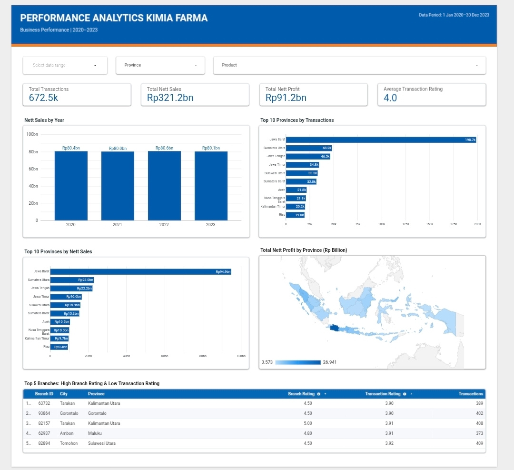

# Performance Analytics Kimia Farma Business 2020–2023

## Project Overview

This project analyzes Kimia Farma's business performance from 2020 to 2023. Transaction, branch, and product data were processed using Google BigQuery and visualized through an interactive Looker Studio dashboard.



## Project Objectives

* Measure total transactions, net sales, net profit, and average transaction rating.
* Compare net sales performance across years.
* Identify provinces with the highest transactions and net sales.
* Analyze the geographic distribution of net profit.
* Identify branches with high branch ratings but relatively low transaction ratings.

## Data Sources

| Table                  | Description                              |
| ---------------------- | ---------------------------------------- |
| `kf_final_transaction` | Transaction and customer rating data     |
| `kf_kantor_cabang`     | Branch, location, and branch rating data |
| `kf_product`           | Product name, category, and price data   |
| `kf_inventory`         | Branch-product inventory data            |

The final analytical table uses one row per transaction. The inventory table was not joined directly because it contains multiple rows for many `branch_id` and `product_id` combinations, which could duplicate transactions and inflate financial metrics.

## Data Processing

The data transformation was performed in Google BigQuery:

1. Used `kf_final_transaction` as the base table.
2. Joined branch information using `branch_id`.
3. Joined product information using `product_id`.
4. Calculated the gross profit percentage according to the product price.
5. Calculated net sales and net profit.
6. Saved the result as `kf_analysis`.

### Gross Profit Percentage

| Actual Price              | Gross Profit Percentage |
| ------------------------- | ----------------------: |
| Up to Rp50,000            |                     10% |
| Above Rp50,000–Rp100,000  |                     15% |
| Above Rp100,000–Rp300,000 |                     20% |
| Above Rp300,000–Rp500,000 |                     25% |
| Above Rp500,000           |                     30% |

### Metric Formulas

```text
nett_sales = actual_price × (1 − discount_percentage)

nett_profit = nett_sales × persentase_gross_laba
```

## SQL Query

The BigQuery transformation query is available here:

[View create_kf_analysis.sql](sql/create_kf_analysis.sql)

## Interactive Dashboard

[Open the Looker Studio Dashboard](https://datastudio.google.com/reporting/582348f4-ecf5-48c8-8d75-715272310d71/page/tEnnC)

The dashboard includes:

* Date, province, and product filters
* Total transactions
* Total net sales
* Total net profit
* Average transaction rating
* Net sales by year
* Top 10 provinces by transactions
* Top 10 provinces by net sales
* Net profit map by province
* Top 5 branches with high branch ratings and low transaction ratings

## Key Results

| Metric                     |          Result |
| -------------------------- | --------------: |
| Total Transactions         |         672,458 |
| Total Net Sales            | Rp321.2 billion |
| Total Net Profit           |  Rp91.2 billion |
| Average Transaction Rating |             4.0 |

## Key Insights

* Annual net sales remained stable at approximately Rp80.0–Rp80.6 billion from 2020 to 2023.
* Jawa Barat recorded the highest contribution, with approximately 198.7 thousand transactions and Rp94.9 billion in net sales.
* Transaction and sales contributions were concentrated in several provinces, particularly across Java and Sumatra.
* Several branches had strong branch ratings while their transaction ratings remained around 3.9–4.0, indicating a potential customer-experience gap.

## Recommendations

* Study the performance drivers in Jawa Barat and adapt relevant strategies for other high-potential provinces.
* Investigate customer feedback and service processes at branches with rating gaps.
* Align product campaigns and inventory planning with regional demand.

## Data Validation

* Source transaction rows: 672,458
* Analytical table rows: 672,458
* Unique transaction IDs: 672,458
* Date coverage: 1 January 2020–30 December 2023
* Unmatched branch IDs: 0
* Unmatched product IDs: 0
* Missing required values: 0
* Invalid financial calculations: 0

## Tools

* Google BigQuery
* SQL
* Looker Studio

## Author

Fahd Abdullah
